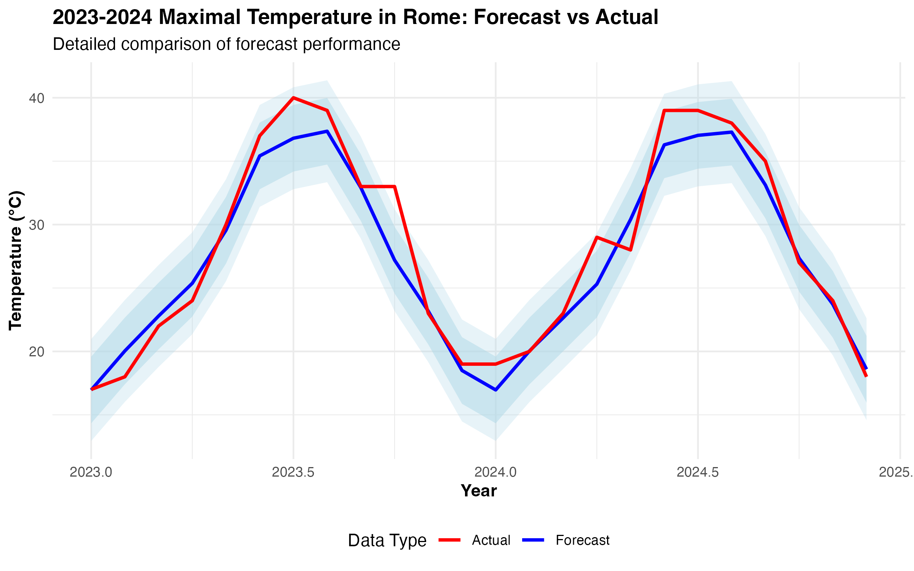
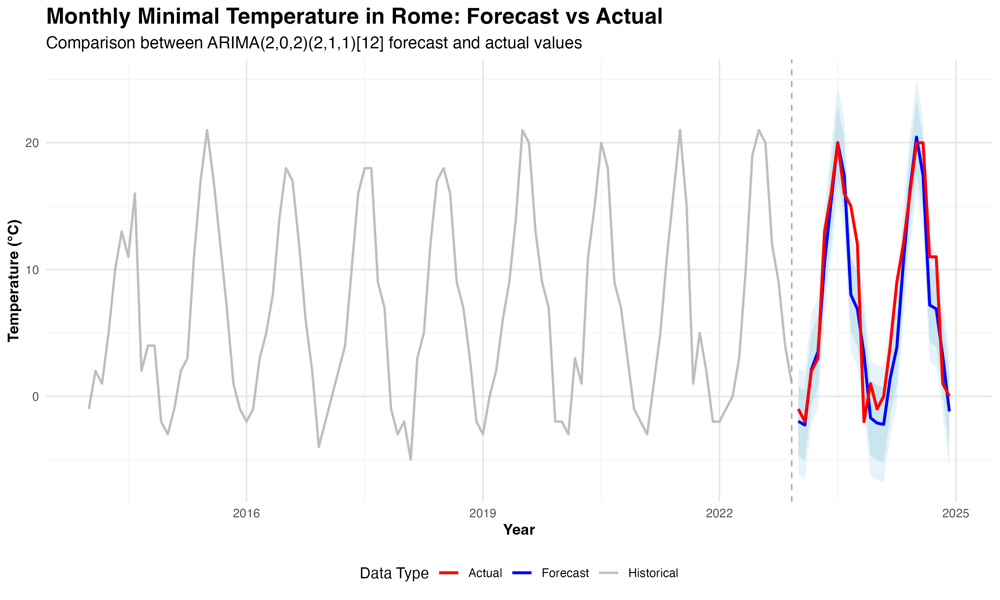
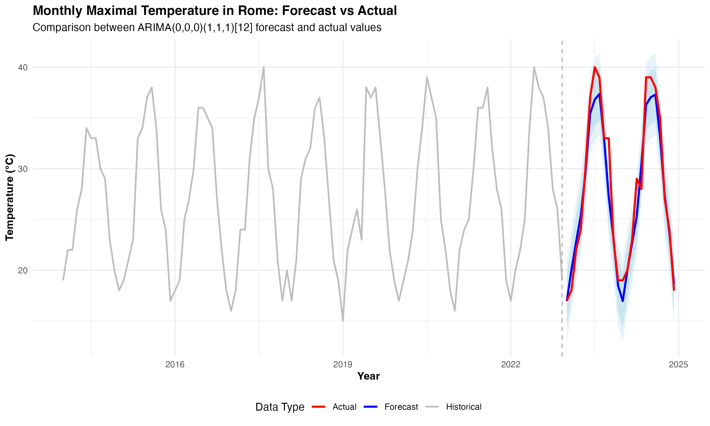

# Time Series Forecasting with SARIMA

Forecasting monthly maximum and minimum temperatures in Rome using Seasonal ARIMA (SARIMA) models, with out-of-sample validation against real observed data.

## Project Overview

This project applies the Box-Jenkins methodology to ten years of monthly temperature data (2014-2022) to forecast temperatures two years ahead (2023-2024), then checks the forecasts against what actually happened. Building a model is the easy part; the point of this project is the validation step, comparing the SARIMA forecast to the real 2023-2024 data rather than stopping at an in-sample fit.

Two series were modelled separately: monthly maximum and minimum temperature.

## Key Findings

### Exploratory analysis

Both series show strong 12-month seasonality and no long-term trend. The ACF for maximum temperature showed strong autocorrelation at lag 1 (0.788) and lag 12 (0.661), confirming both short-term persistence and annual seasonality; the PACF pointed to an AR(1) structure. The Augmented Dickey-Fuller test rejected non-stationarity for both series (p < 0.01), particularly after seasonal differencing at lag 12.

### Model fit

| Series | Model selected | Training RMSE | Training MASE |
|---|---|---|---|
| Maximum temperature | ARIMA(0,0,0)(1,1,1)[12] | 1.91 | 0.63 |
| Minimum temperature | ARIMA(2,0,2)(2,1,1)[12] | 1.92 | 0.61 |

The maximum-temperature series needed only seasonal terms, no non-seasonal AR/MA component was selected, meaning the annual cycle alone explained most of the structure. The minimum-temperature series needed a fuller specification with both seasonal and non-seasonal AR/MA terms to pass residual diagnostics.

### Out-of-sample validation: forecast vs what actually happened

| Series | Test RMSE | Test MASE | Test MAPE |
|---|---|---|---|
| Maximum temperature | 2.00 | 0.66 | 4.95% |
| Minimum temperature | 2.93 | 1.03 | n/a (values near zero) |



The maximum-temperature model held up well out-of-sample: MASE stayed below 1 on the test set (0.66), meaning it still outperformed a naive seasonal-average baseline on data it had never seen. The minimum-temperature model's test MASE (1.03) crossed just above 1, roughly on par with a naive forecast, a realistic outcome given minimum temperatures are noisier and closer to zero (which also breaks the MAPE metric via division issues).



### Residual diagnostics

Ljung-Box tests on both models' residuals failed to reject the null of no remaining autocorrelation (maximum temperature: p = 0.963; minimum temperature: Q* = 14.52, p = 0.486), confirming the SARIMA structure captured the available signal rather than leaving a pattern behind in the residuals.



## Methodology

- **Data**: Monthly max/min temperature, Rome, 2014-2022 (training) and 2023-2024 (held-out validation)
- **Model selection**: `auto.arima()` with seasonal search, selected by AIC
- **Stationarity**: Augmented Dickey-Fuller test, before and after seasonal differencing
- **Validation**: Out-of-sample forecast accuracy (RMSE, MAE, MAPE, MASE, Theil's U) against real 2023-2024 observations, not just in-sample fit
- **Residual diagnostics**: Ljung-Box test, ACF of residuals, residual normality checks

## Technologies Used

- **R**: `forecast`, `tseries`, `ggplot2`, `readxl`, `dplyr`, `tidyr`

## Limitations and Further Work

The minimum-temperature MAPE is undefined because values sit near or below zero, a known limitation of percentage-based error metrics on data that crosses zero; MASE is used as the primary metric for that series instead. Natural extensions: compare against a simpler seasonal-naive or exponential smoothing (ETS) baseline directly, and test whether an external regressor (e.g. a broader European temperature index) improves the forecast.

## How to Run

```r
install.packages(c("forecast", "tseries", "ggplot2", "readxl", "dplyr", "tidyr"))
rmarkdown::render("time_series_sarima.Rmd")
```

## Author

**Amba Sharma** — BSc Mathematics (Applied Mathematics emphasis), University of Leicester.
